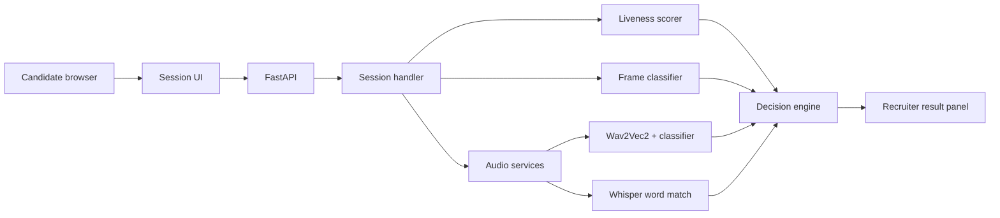
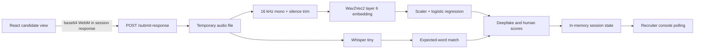

# Sapien

Sapien is a multi modal authenticity API. Sapien checks if a live video, audio, image, or text session is real or synthetic. Sapien returns one signal, in real time, through one integration point.


## What the demo proves

1. A single API can carry a live liveness check and a voice check.
2. The check returns a real or synthetic signal in real time, during a live session.

Image authenticity and text authenticity are not part of this build. They are roadmap items only.

## Tech stack

| Layer | Tool | Notes |
|---|---|---|
| Face and head tracking | MediaPipe Face Landmarker | Runs client side, in the browser, via WebAssembly |
| Challenge response scoring | Hand written rule logic | Deterministic code, no model |
| Deepfake artifact detection | `dima806/deepfake_vs_real_image_detection` (Hugging Face) | Pretrained ViT classifier, inference only |
| Voice authenticity | Existing prototype | Reused as is, not rebuilt |
| Backend | FastAPI | Python |
| Frontend | React, TypeScript, Vite | Candidate and recruiter surfaces |

No model is trained or fine tuned in this build. All ML use is pretrained inference only.

## Architecture



The current branch implements the session API, browser liveness capture, audio
authenticity, word matching, frame classification, and the combined result.

### Audio request flow



`POST /submit-audio` remains available for isolated audio testing. The React
session uses `POST /submit-response`. A high-confidence deepfake voice is a
safety veto and cannot be outweighed by a liveness score.

## Getting started

This section follows ASD-STE100 (Simplified Technical English). Each step gives one instruction.

### Prerequisites

Install Python 3.11 or a later version. Do not use Python 3.9. The supplied
voice classifier requires scikit-learn 1.9.1, which requires Python 3.11 or
later. The backend is verified with Python 3.13.
Install Git.
Install pip.
Install FFmpeg.
Install Node.js 22.17.0 and pnpm.

### Clone the repository

Open a terminal.
Run this command:

```bash
git clone <repo-url>
cd sapien
```

### Backend setup

Go to the backend folder:

```bash
cd backend
```

Create a virtual environment:

```bash
python -m venv venv
```

Activate the virtual environment.

On macOS or Linux, run this command:

```bash
source venv/bin/activate
```

On Windows, run this command:

```bash
venv\Scripts\activate
```

Install the backend dependencies:

```bash
pip install -r requirements.txt
```

Add your Hugging Face token to `backend/.env`:

```env
HF_TOKEN=hf_your_token_here
```

Start the API server:

```bash
uvicorn app.main:app --reload
```

The API server runs at `http://localhost:8000`.

The first backend start downloads `facebook/wav2vec2-base`, the English-only
Whisper `base.en` model, and the `dima806` image classifier. Later starts use
the local model cache. Set `SAPIEN_WHISPER_MODEL=tiny` before startup if you
need faster local inference.

### Frontend setup

Open a second terminal and go to the frontend folder:

```bash
cd frontend
pnpm install
pnpm dev
```

Open `http://localhost:5173`.

The frontend uses the live FastAPI session endpoints. Liveness, frame
classification, and voice authenticity are enabled for ATS interviews and
video calls.

The launcher supports two scenarios:

- **ATS interview** runs the three scripted liveness and voice prompts.
- **Video call** runs eight five-second monitoring windows and one surprise
  identity challenge. The backend shows the challenge after the first
  five-second window, or the operator can request it from the console.

To test a generated candidate video, save it as:

```text
frontend/public/media/synthetic-candidate.mp4
```

Then select **Video call**, enable **Use synthetic candidate clip**, and start
the session. The file must contain an audio track because each passive call
window runs voice-authenticity analysis.

FastAPI's interactive API documentation is available at:

```text
http://localhost:8000/docs
```

### Run automated tests

From the `backend` directory, run:

```bash
python -m unittest discover -s tests -v
```

## API overview

All requests go through the API layer. No detection service is called directly by the frontend.

| Method | Path | Purpose | Status |
|---|---|---|---|
| GET | `/health` | Check whether all three inference models loaded | Implemented |
| POST | `/classify-frame` | Classify one uploaded image for debugging | Implemented |
| POST | `/submit-audio` | Run voice authenticity and expected-word checks | Implemented |
| POST | `/start-session` | Start a session and get the first prompt | Implemented |
| POST | `/submit-response` | Submit a complete prompt response | Implemented |
| POST | `/request-challenge` | Queue a video-call identity challenge | Implemented |
| GET | `/session-status` | Poll session progress and result | Implemented |
| GET | `/get-result` | Get the combined real or synthetic signal | Implemented |

Send a test audio request:

```bash
curl -X POST http://localhost:8000/submit-audio \
  -F "expected_word=orange river seven bright morning" \
  -F "audio_clip=@sample.wav"
```


## Project structure

```
sapien/
  backend/
    app/
      audio/
        analysis.py
        contracts.py
        voice_detection.py
        word_match.py
      main.py
      session_api.py
    vendor/
      vishield/
        training/
          features.py
          w2v.py
        model/
          deepfake_detector_w2v.joblib
    tests/
      test_audio.py
    requirements.txt
  frontend/
    public/
    src/
    index.html
    package.json
    vite.config.ts
  README.md
```

Keep the model layer separate from the route layer in the backend. This makes it easier to swap a model later without a rewrite.

The audio module has two independent checks. Vishield returns the probability
that a voice is synthetic. Whisper checks whether the candidate said the
prompt's expected phrase.

## Out of scope for this weekend

Do not build these. They are roadmap items only.

- Image authenticity module
- Text authenticity module
- White label licensing or embedding into a third party platform
- Any trained or fine tuned model
- A custom deepfake generator for test clips
- User accounts, persistent storage beyond a session, or production grade auth

## Team notes

For the full pitch, the market context, and the competitive landscape, see the project's pitch summary document.
For every build decision, the tool stack rationale, and the API contract.

Project: Sapien. Built for Origin Weekend, Fall 2026.
