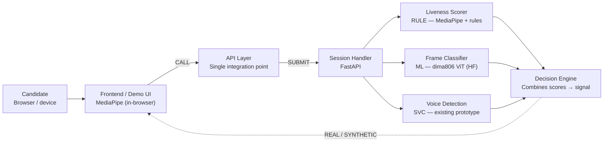

# Technical Handoff — Sapien

**Status:** Ready for build. **Scope:** Origin Weekend hackathon demo.
**Project name:** Finalized — **Sapien**. Use `sapien` (lowercase) in code, package names, and API paths going forward.

This document is the single source of truth for implementation. A new session — human or agentic — should be able to start coding from this file alone, without reading prior chat history.

Technical sections in this document follow **ASD-STE100 (Simplified Technical English)**: short sentences, one instruction or one fact per sentence, active voice, and plain approved vocabulary. This removes ambiguity for both human developers and coding agents.

---

## 1. The pitch, in one paragraph

Remote interactions are open to attack from AI-generated humans. Interviewers cannot reliably tell a real candidate from a synthetic one. The platform is a single API. The API checks whether a live video and audio session is a real human. The API returns one signal: real or synthetic. The platform replaces four separate vendor tools with one integration.

## 2. What we are building this weekend

We build a working demo. The demo is not the full product. The demo proves two things:

1. A single API can carry a live liveness check and a voice check.
2. The check returns a real/synthetic signal in real time, during a live session.

Image authenticity and text authenticity are **not** part of the weekend build. Mark them "Roadmap" in any pitch material.

---

## 3. Platform components (full-product scope)

The full platform has six components. The weekend build implements four of them (marked ✅). Two are roadmap only (marked 🔜).

| # | Component | Weekend scope |
|---|---|---|
| 1 | Liveness Capture Module | ✅ |
| 2 | Voice Authenticity Module | ✅ (existing prototype, reused) |
| 3 | Image Authenticity Module | 🔜 roadmap |
| 4 | Text Authenticity Module | 🔜 roadmap |
| 5 | Decision Engine | ✅ |
| 6 | API / SDK Layer | ✅ |

### 3.1 Liveness Capture Module
The module records a live video session. The module sends unscripted prompts to the candidate. The module measures the candidate's response. The module flags a session as synthetic on a pattern mismatch.

### 3.2 Voice Authenticity Module
The module receives a live or stored audio stream. The module compares the stream against known clone or synthesis patterns. The module returns a human-probability score. **This is an existing working prototype.** Do not rebuild it. Integrate it as-is behind the API Layer.

### 3.3 Decision Engine
The engine collects a result from each active module. The engine combines the results into one signal. The signal has two states: real or synthetic. The engine returns a confidence value with the signal.

### 3.4 API / SDK Layer
The layer accepts one request type per input: video, audio, image, or text. The layer returns the Decision Engine's signal in real time. The layer is the single integration point for a customer platform.

---

## 4. Decided tool stack

**Rule for this weekend: do not train a model. Do not fine-tune a model. Use pretrained inference only.** Training needs labeled data and GPU time. Neither is available in the build window. A trained model is a named roadmap item, not a weekend deliverable.

| Problem | Tool | Type | Notes |
|---|---|---|---|
| Face and head tracking | MediaPipe Face Landmarker | Pretrained, runs client-side | Runs in the browser via WebAssembly. Ships ready to use. No training. |
| Challenge-response scoring | Hand-written rule logic | Deterministic code | Reads MediaPipe's landmark output. No model. |
| Deepfake artifact detection | `dima806/deepfake_vs_real_image_detection` (Hugging Face) | Pretrained ML, inference only | ViT-base classifier, 85.8M parameters, Apache-2.0 license. Runs on CPU. |
| Voice authenticity | Existing prototype | Pretrained / already built | Reuse. Do not rebuild. |
| Backend framework | FastAPI (preferred) or Flask | Framework | Python. Keep the model layer separate from the route layer. |
| Frontend | React or plain HTML/JS | Framework | Keep it to the screens the demo needs. No extra pages. |

### 4.1 The deepfake classifier — exact usage

Model: `dima806/deepfake_vs_real_image_detection`
Library: Hugging Face `transformers`
Call pattern:

```python
from transformers import pipeline

detector = pipeline("image-classification", model="dima806/deepfake_vs_real_image_detection")
result = detector(sampled_frame)
# result -> [{'label': 'Real', 'score': 0.87}, {'label': 'Fake', 'score': 0.13}]
```

**Known limitation, state it in the pitch if asked:** the model was trained on data collected roughly three years before this hackathon. Deepfake generation tools have advanced since. Do not trust the model's default 0.5 fake-threshold. Set a lower threshold instead.

```python
FAKE_THRESHOLD = 0.15  # not the model's default of 0.5 — set deliberately, document why
```

**Backup model, use only if the primary model fails on your test clips:** `prithivMLmods/Deepfake-Detection-Exp-02-21` (also a pretrained ViT, same `pipeline()` call pattern, has an ONNX version for faster CPU inference).

### 4.2 MediaPipe — exact usage

Use MediaPipe Face Landmarker, browser build, loaded via WebAssembly. Run it client-side, inside the frontend. Do not stream raw video to the backend for landmark detection — that adds latency and bandwidth cost the weekend build does not need.

The frontend computes a landmark-motion score locally. Example checks:
- Did the nose-tip x-coordinate move right by more than N pixels within 3 seconds? (head-turn prompt)
- Did the mouth-landmark distance change in a pattern consistent with speech? (speak-word prompt)

Send only the following to the backend, not the raw video stream:
1. The landmark-motion score (a small JSON object).
2. A small number of sampled video frames (3–5 per session) for the deepfake artifact check.
3. The audio clip, for the voice check.

---

## 5. System architecture

### 5.1 Data flow (text form, for agentic reading)

1. The candidate opens the Frontend in a browser.
2. The Frontend calls the API Layer to start a session.
3. The API Layer forwards the request to the Session Handler.
4. The Session Handler issues an unscripted prompt back to the Frontend.
5. The Frontend runs MediaPipe locally. The Frontend shows the prompt to the candidate.
6. The candidate responds. MediaPipe tracks the response in the browser.
7. The Frontend computes a landmark-motion score locally.
8. The Frontend submits three things to the API Layer: the landmark-motion score, 3–5 sampled video frames, and the audio clip.
9. The Session Handler routes each input to its detection service:
   - The landmark-motion score goes to the Liveness Scorer (rule logic, no model).
   - The sampled frames go to the Frame Classifier (`dima806` ViT, pretrained inference).
   - The audio clip goes to the Voice Detection Service (existing prototype).
10. Each service returns a score to the Decision Engine.
11. The Decision Engine combines the three scores into one signal: real or synthetic. The Decision Engine attaches a confidence value.
12. The Decision Engine returns the signal to the Frontend, through the API Layer.
13. The Frontend's Result Panel shows the signal. **The candidate does not see this panel.** Only the recruiter/demo-operator side sees it.

### 5.2 Data flow diagram (Mermaid — renders in most Markdown viewers and coding tools)



Tag key: `RULE` = deterministic code, no model. `ML` = pretrained model, inference only. `SVC` = existing prototype, reused as-is.

### 5.3 Reference image files

The same diagram is also available as rendered image assets, delivered alongside this document:
- `architecture-diagram.png` — presentation-ready, transparent background
- `architecture-diagram.svg` — editable, for Figma/Illustrator

---

## 6. API contract

Base rule: **one integration point.** All requests go through the API Layer. No detection service is called directly by the Frontend.

### 6.1 `POST /start-session`
Starts a session. Returns a session ID and the first prompt.

Request body:
```json
{ "candidate_id": "string, optional for the demo" }
```

Response body:
```json
{
  "session_id": "uuid",
  "prompt": { "index": 1, "of": 3, "instruction": "Turn your head slightly to the right, then say 'orange'." }
}
```

### 6.2 `POST /submit-response`
Submits one prompt's response. Carries the landmark-motion score, the sampled frames, and the audio clip together.

Request body:
```json
{
  "session_id": "uuid",
  "prompt_index": 1,
  "landmark_motion_score": 0.0,
  "frames": ["base64 image", "base64 image", "base64 image"],
  "audio_clip": "base64 audio"
}
```

Response body (advances to next prompt, or signals the session is complete):
```json
{
  "session_id": "uuid",
  "status": "in_progress",
  "next_prompt": { "index": 2, "of": 3, "instruction": "Say the word 'orange' now." }
}
```

### 6.3 `GET /get-result?session_id=uuid`
Returns the combined decision. Call this after the last prompt is submitted.

Response body:
```json
{
  "session_id": "uuid",
  "signal": "real",
  "confidence": 0.91,
  "component_scores": {
    "liveness_scorer": 0.95,
    "frame_classifier": 0.89,
    "voice_detection": 0.88
  },
  "flag_reason": null
}
```

When the signal is `"synthetic"`, populate `flag_reason` with a short machine-readable code, for example `"frame_classifier_below_threshold"` or `"liveness_timing_mismatch"`.

### 6.4 Endpoint summary table

| Method | Path | Purpose |
|---|---|---|
| POST | `/start-session` | Begin a session, get the first prompt |
| POST | `/submit-response` | Submit one prompt's response, get the next prompt or completion |
| GET | `/get-result` | Get the combined real/synthetic signal |

---

## 7. Decision Engine logic

Use a fixed formula. Do not use a learned/trained weighting for the weekend build — a fixed formula is easier to explain to judges and easier to debug.

```python
def decide(liveness_score: float, frame_score: float, voice_score: float) -> dict:
    # All three input scores are 0.0-1.0, where 1.0 = confidently human/real.
    WEIGHTS = {"liveness": 0.4, "frame": 0.35, "voice": 0.25}
    combined = (
        liveness_score * WEIGHTS["liveness"]
        + frame_score * WEIGHTS["frame"]
        + voice_score * WEIGHTS["voice"]
    )
    signal = "real" if combined >= 0.5 else "synthetic"
    return {"signal": signal, "confidence": round(combined, 2)}
```

State the weights and the threshold as named constants. Do not hard-code magic numbers inline. A judge or teammate must be able to find and change these values in one place.

---

## 8. Component build list

### 8.1 Frontend components

| Component | What it does | Tool |
|---|---|---|
| Demo Host Interface | Plays the role of the customer's product (mock ATS interview screen). Starts the session. Calls the API. | React or plain HTML/JS |
| Live Session View | Shows the candidate's camera feed. Shows the on-screen prompt. Runs MediaPipe locally. Records and sends the response. | MediaPipe Face Landmarker (WASM) |
| Result Panel | Shows the real/synthetic output. Shows the confidence score. Shows the flag reason, if any. **Shown only on the recruiter/demo-operator side.** | Same frontend app, gated view |
| Admin Toggle View (optional) | Lets the demo operator turn a detection module on or off. No real user accounts needed. | Same frontend app |

### 8.2 Backend components

| Component | What it does | Tool |
|---|---|---|
| Session Handler | Starts a session. Issues prompts. Stores session state (memory or a small database is enough). | FastAPI (preferred) or Flask |
| Liveness Scorer | Reads the landmark-motion score from the request. Applies rule logic. Returns a 0.0–1.0 score. | Hand-written Python, no model |
| Frame Classifier | Reads the sampled frames. Runs each frame through the pretrained classifier. Averages the per-frame scores. | `dima806/deepfake_vs_real_image_detection` via `transformers` pipeline |
| Voice Detection Service | Existing prototype. Scores an audio clip for clone/synthesis. | Existing code — integrate, do not rebuild |
| Decision Engine | Combines the three scores. Returns one signal and a confidence value. | Hand-written Python, fixed formula (see Section 7) |
| API Layer | Exposes the three endpoints in Section 6. Routes requests to the Session Handler. | FastAPI (preferred) or Flask |

---

## 9. Suggested build order

Build in this order. Each step should produce something runnable before moving to the next step.

1. Stand up the API Layer with the three endpoints, returning stub/fake data.
2. Build the Frontend's Demo Host Interface and Live Session View, wired to the stub API.
3. Add MediaPipe to the frontend. Compute a real landmark-motion score. Send it in `/submit-response`.
4. Build the Liveness Scorer on the backend. Replace the stub score with the real rule-based score.
5. Add frame sampling to the frontend (3–5 frames per session). Build the Frame Classifier using the pretrained model. Replace the stub score.
6. Integrate the existing Voice Detection prototype behind `/submit-response` and `/get-result`.
7. Implement the real Decision Engine formula (Section 7). Remove all stub data.
8. Build the Result Panel. Confirm it is hidden from the candidate's own view.
9. Record or prepare the "synthetic candidate" test clip (see Section 10). Do not build a deepfake generator — use an existing tool or a pre-made clip, purely as test input.
10. Rehearse the full demo script (Section 11) at least twice before presenting.

---

## 10. Test data for the "synthetic candidate" demo

Do not build a deepfake generator this weekend. Effort spent there does not improve the pitch — the value is in detection, not generation.

Use one of the following as pre-recorded test input:
- A short clip from an existing public face-swap or avatar demo tool.
- A voice-clone clip made with an existing consumer tool.
- A screen-recording trick (playing a video of a person in front of the camera) as a low-effort fallback.

Prepare this clip ahead of the live demo. Do not generate it live on stage.

---

## 11. Demo script

1. Open the mock ATS interview screen (Demo Host Interface).
2. Team member 1 joins as the "real candidate." The system runs the liveness check and the voice check. The Result Panel shows **Real** with a high confidence score.
3. Team member 2 plays a "synthetic candidate," using the prepared test clip from Section 10. The Result Panel shows **Synthetic** with the flag reason.
4. Narrate the "one API, one integration" pitch during the transition between steps 2 and 3.
5. Point to the roadmap (Image and Text Authenticity Modules) as the next stage after the hackathon.

---

## 12. Explicitly out of scope this weekend

Do not build these. Mention them only as roadmap items in the pitch.

- Image Authenticity Module
- Text Authenticity Module
- White-label licensing / embedding into a third-party platform
- Any trained or fine-tuned model
- A custom deepfake generator for test clips
- User accounts, persistent storage beyond a session, or production-grade auth

---

## 13. Delivery model (for pitch context, not build scope this weekend)

- **Primary:** embedded API/SDK. The customer's product stays in front of the candidate. The SDK calls the API in the background.
- **Secondary (later stage):** white-label licensing to a large platform (e.g. a video conferencing provider).
- **Beachhead customer:** ATS/recruiting platforms. Integration paths: direct API integration for teams with engineers, or a pre-built marketplace plugin (Greenhouse, Lever, Workday) for smaller teams.

---

## 14. Open questions for the team

- Confirm which backend framework: FastAPI or Flask. Either works; pick one and keep it consistent across all backend files.
- Confirm frontend framework: React or plain HTML/JS. Plain HTML/JS is faster to start; React is easier to extend if the demo grows mid-weekend.
- Confirm where session state lives: in-memory dictionary is enough for a single-demo weekend build; do not build a production database.
- Confirm who prepares the "synthetic candidate" test clip (Section 10), and by when — this has a dependency on the demo rehearsal (build step 10).

---

## 15. Voice Authenticity Module — implementation detail

Section 3.2 names the Voice Authenticity Module as an existing prototype. This section states exactly what that prototype is, and how to integrate it. Do not rebuild it. Integrate it as a function call inside the Session Handler.

### 15.1 Source prototype: Vishield

Vishield is a working prototype, built separately, that classifies a speech clip as real or AI-generated.

| Layer | Technology |
|---|---|
| Embedding model | `facebook/wav2vec2-base`, frozen, not fine-tuned. About 95M parameters. |
| Classifier | StandardScaler + LogisticRegression (C=0.05, L2 penalty), trained on the embeddings |
| Fallback (not used in this integration) | XGBoost on handcrafted MFCC/spectral features |
| Measured accuracy | 97.3% on held-out generators, 99.1% on unseen speakers |
| Known weak spot | ElevenLabs-generated speech scored 83%. Gemini TTS was not tested. |
| Measured latency (CPU) | About 0.2s for a 5-second clip. About 0.8–1.4s for a 13-second clip. |

**Rule for this weekend:** reuse Vishield's embedding function and trained classifier file only. Do not reuse Vishield's own Flask server, routes, or frontend. Do not use the XGBoost fallback path.

### 15.2 Files needed from the Vishield project

Copy only these files into the Sapien backend:

| File | Purpose |
|---|---|
| `training/w2v.py` | Extracts the 768-number embedding from an audio clip |
| `model/deepfake_detector_w2v.joblib` | The trained classifier. Outputs P(deepfake), a number from 0 to 1. |
| `requirements.txt` | Pinned versions for `torch`, `transformers`, `librosa`, `scikit-learn`, `soundfile`. Merge these into the Sapien backend's own requirements file. |

Do not copy: `app.py`, `templates/`, `static/`, the XGBoost model file, or the old `.h5` model file. These are not part of this integration.

### 15.3 Voice Detection Service — function contract

The Voice Detection Service is a Python function inside the Sapien backend. It is not a second web server.

```python
def detect_voice_deepfake(audio_path: str) -> dict:
    # 1. Resample audio to 16kHz mono.
    # 2. Trim leading and trailing silence (top_db=30).
    # 3. Reject the clip if it holds under 1 second of speech.
    # 4. Extract the embedding (Vishield's w2v.py logic).
    # 5. Score the embedding with the loaded classifier.
    # Returns:
    return {"label": "real", "score": 0.12, "confidence": 0.88}
```

Load `facebook/wav2vec2-base` and `deepfake_detector_w2v.joblib` once, at backend startup. Do not reload either on each request.

Thresholds, as named constants, not inline numbers:

```python
REAL_THRESHOLD = 0.35     # score below this: "real"
FAKE_THRESHOLD = 0.65     # score above this: "deepfake"
                            # a score between the two thresholds: "uncertain"
```

### 15.4 Word-match check (new, added alongside the voice score)

The Voice Authenticity Module, as sourced from Vishield, answers one question only: is this voice synthetic? It does not check what the candidate said. Add a second, separate check for that.

| Component | What it does | Tool |
|---|---|---|
| Word-Match Service | Transcribes the audio clip. Compares the transcription against the prompt's expected word. Returns a yes/no match. | Whisper, tiny or base model, local inference |

This ties the audio check back to the same challenge-response pattern the Liveness Capture Module already uses for video (Section 3.1). Run the Word-Match Service and the Voice Detection Service on the same audio clip, in the same request.

### 15.5 Updated data flow for the audio path

This extends step 9 of Section 5.1. The landmark-motion and frame steps do not change.

9a. The audio clip goes to the Voice Detection Service (Section 15.3). The Voice Detection Service returns a label, a score, and a confidence value.
9b. The same audio clip also goes to the Word-Match Service (Section 15.4). The Word-Match Service returns a yes/no match against the expected prompt word.
9c. The Session Handler passes the Voice Detection Service's score to the Decision Engine, as `voice_score` (Section 7). The word-match result is carried as a supporting flag, not a fourth weighted score — use it to set `flag_reason` (Section 6.3) when the voice score passes but the word does not match.

### 15.6 Test data note for the audio path

Before the demo, run the prepared "synthetic candidate" test clip (Section 10) through Vishield's classifier ahead of time, using its own `training/check_file.py`. If the clip's TTS source scores poorly (ElevenLabs, or an untested generator such as Gemini), either regenerate the test clip with a different tool, or add a small number of custom clips through Vishield's `training/add_custom.py` and retrain. Only the classifier retrains in that case — the frozen wav2vec2-base embedding step does not change.

---

*This document supersedes prior chat-based descriptions of the architecture. If a conflict appears between this document and an earlier conversation, this document is correct. Project name: Sapien.*
